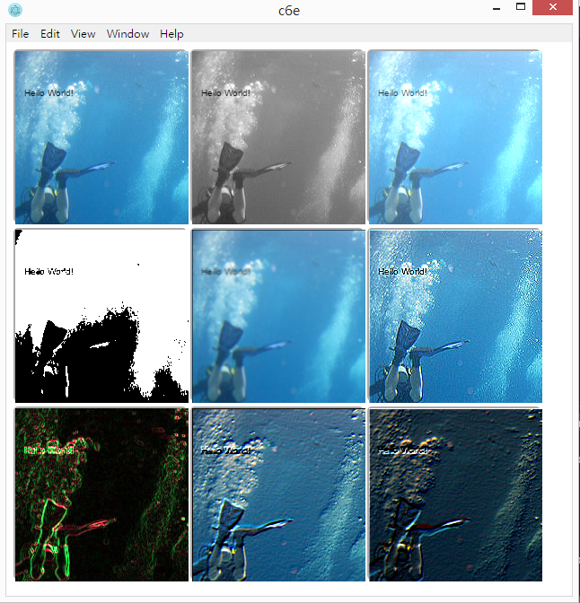

# c6demo -- c6 and c6e demo

* [c6](https://github.com/ccckmit/c6) : A chart library for node.js
* [c6e](https://github.com/ccckmit/c6e) : A chart GUI based on electron.js

The c6e project is for node.js command mode, not for web pages.

## Run

```
$ npm install -g electron
$ npm install -g c6e
$ git clone https://github.com/ccckmit/c6demo.git
$ cd c6demo
$ npm install
```

## Example 1 : Chart

```
$ c6e demo/chartDemo.js
```


Source code : [chartDemo.js](demo/chartDemo.js)


## Example 2 : Image Processing

```
$ c6e demo/imageDemo.js
```




Source code : [imageDemo.js](demo/imageDemo.js)
